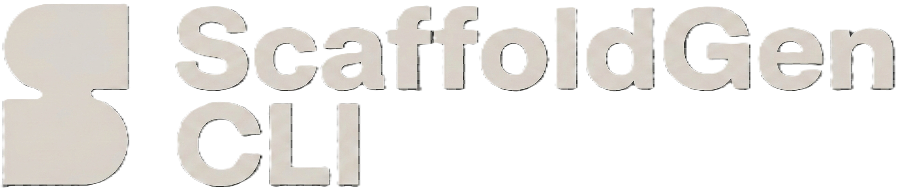

# 🚀 ScaffoldGen - Landing Page

<div align="center">



[](https://nextjs.org/)
[](https://www.typescriptlang.org/)
[](https://tailwindcss.com/)
[](https://www.framer.com/motion/)
[](https://vercel.com/)

*A stunning, modern landing page for ScaffoldGen CLI - built with Next.js, TypeScript, and Tailwind CSS*

[🌐 Live Demo](https://scaffoldgen-zeta.vercel.app/) • [📖 ScaffoldGen CLI](#) • [🚀 Quick Start](#quick-start)


</div>

---

## ✨ Overview

This is a beautifully designed, fully responsive landing page for **ScaffoldGen CLI** - a powerful command-line interface tool that helps developers create projects, generate components, and manage workflows with lightning speed.

The landing page showcases ScaffoldGen's features through an engaging, interactive experience with smooth animations, modern design patterns, and comprehensive information about the CLI tool.

### 🎯 Key Features

- **🎨 Modern Design**: Sleek, professional design with dark theme and gradient backgrounds
- **📱 Fully Responsive**: Optimized for all devices - desktop, tablet, and mobile
- **⚡ Smooth Animations**: Powered by Framer Motion for delightful user interactions
- **🧩 Component-Based**: Modular React components with TypeScript
- **🎭 Interactive Elements**: Terminal animations, scroll-triggered animations, and hover effects
- **🚀 Performance Optimized**: Built with Next.js for optimal loading and SEO

---

## 🛠️ Tech Stack

<div align="center">

| Technology | Purpose | Version |
|------------|---------|---------|
|  | React Framework | `16.0.10` |
|  | Type Safety | `5.0+` |
|  | Styling | `3.4+` |
|  | Animations | `12.29.0` |
|  | UI Components | `1.x` |
|  | Icons | `0.454.0` |

</div>

### 📦 Dependencies

**UI Components & Styling:**
- `@radix-ui/*` - Unstyled, accessible UI primitives
- `class-variance-authority` - Class variant utilities
- `clsx` - Conditional CSS classes
- `tailwind-merge` - Tailwind class merging
- `lucide-react` - Beautiful icon library

**Animations & Interactions:**
- `framer-motion` - Production-ready motion library
- `embla-carousel-react` - Carousel component

**Forms & Validation:**
- `@hookform/resolvers` - Form validation resolvers
- `input-otp` - OTP input component

**Utilities:**
- `date-fns` - Modern JavaScript date utility library
- `cmdk` - Command palette component

---

## 🚀 Quick Start

### Prerequisites

- **Node.js** 18+ ✅
- **npm** or **yarn** ✅
- **Git** ✅

### Installation

1. **Clone the repository**
   ```bash
   git clone https://github.com/yourusername/scaffoldgen-landing.git
   cd scaffoldgen-landing
   ```

2. **Install dependencies**
   ```bash
   npm install
   # or
   yarn install
   ```

3. **Start the development server**
   ```bash
   npm run dev
   # or
   yarn dev
   ```

4. **Open your browser**

   Navigate to [http://localhost:3000](http://localhost:3000) to see the landing page.

---

## 📁 Project Structure

```
scaffoldgen-landing/
├── 📁 app/                          # Next.js App Router
│   ├── 📁 components/               # React Components
│   │   ├── 📄 AboutSection.tsx      # CLI demo section
│   │   ├── 📄 AnimatedOnScroll.tsx  # Scroll animations
│   │   ├── 📄 ComponentLoader.tsx   # Loading wrapper
│   │   ├── 📄 DownloadReleaseSection.tsx # Download section
│   │   ├── 📄 FAQSection.tsx        # FAQ component
│   │   ├── 📄 FeaturesSection.tsx   # Features showcase
│   │   ├── 📄 Footer.tsx            # Site footer
│   │   ├── 📄 GlobalUsersSection.tsx # User stats
│   │   ├── 📄 HeroSection.tsx       # Main hero section
│   │   ├── 📄 LoadingOverlay.tsx    # Loading states
│   │   ├── 📄 MajorContributors.tsx # Contributors section
│   │   ├── 📄 Navbar.tsx            # Navigation bar
│   │   ├── 📄 OrganizationSection.tsx # Organization info
│   │   ├── 📄 TestimonialsSection.tsx # User testimonials
│   ├── 📄 globals.css               # Global styles
│   ├── 📄 layout.tsx                # Root layout
│   └── 📄 page.tsx                  # Home page
├── 📁 public/                       # Static assets
│   ├── 📄 logo.png                  # ScaffoldGen logo
│   ├── 📄 favicon.ico               # Favicon
│   └── 📁 fonts/                    # Custom fonts
├── 📄 package.json                  # Dependencies & scripts
├── 📄 tailwind.config.ts            # Tailwind configuration
├── 📄 tsconfig.json                 # TypeScript configuration
├── 📄 next.config.ts                # Next.js configuration
├── 📄 postcss.config.mjs            # PostCSS configuration
└── 📄 eslint.config.mjs             # ESLint configuration
```

---

## 🎨 Design System

### Color Palette

```css
/* Primary Colors */
--scaffoldgen-orange: #ff6b35;
--scaffoldgen-orange-light: #ff9a6b;

/* Neutral Colors */
--black: #000000;
--gray-950: #0a0a0a;
--gray-900: #111111;

/* Accent Colors */
--cyan-400: #22d3ee;
--green-400: #4ade80;
--yellow-300: #fde047;
```

### Typography

- **Font Family**: System fonts with fallbacks
- **Headings**: Bold, tracking-tight for impact
- **Body**: Regular weight, optimized for readability
- **Code**: Monospace for terminal commands

### Animations

- **Scroll-triggered**: Elements animate in as they enter viewport
- **Hover effects**: Interactive buttons with glow and scale
- **Terminal typing**: Realistic command-line animations
- **Loading states**: Smooth transitions and skeleton loaders

---

## 📜 Available Scripts

```json
{
  "scripts": {
    "dev": "next dev",
    "build": "next build",
    "start": "next start",
    "lint": "eslint ."
  }
}
```

- **`npm run dev`** - Start development server with hot reload
- **`npm run build`** - Build for production
- **`npm run start`** - Start production server
- **`npm run lint`** - Run ESLint for code quality

---

## 🚀 Deployment

### Vercel (Recommended)

1. **Connect your repository** to Vercel
2. **Configure build settings**:
   - Build Command: `npm run build`
   - Output Directory: `.next`
   - Install Command: `npm install`
3. **Deploy automatically** on every push to main

### Other Platforms

The app can be deployed to any platform supporting Next.js:

- **Netlify**: Use `npm run build` as build command
- **Railway**: Automatic deployment from GitHub
- **Render**: Use Node.js runtime with `npm start`

---

## 🔧 Configuration

### Environment Variables

Create a `.env.local` file for environment-specific settings:

```env
# Analytics (optional)
NEXT_PUBLIC_VERCEL_ANALYTICS=true

# Custom domain (optional)
NEXT_PUBLIC_SITE_URL=https://scaffoldgen.dev
```

### Tailwind Configuration

The design system is configured in `tailwind.config.ts`:

```typescript
// Custom colors, animations, and utilities
export default {
  theme: {
    extend: {
      colors: {
        scaffoldgen: {
          orange: '#ff6b35',
          'orange-light': '#ff9a6b',
        }
      },
      animation: {
        'glow': 'glow 2s ease-in-out infinite alternate',
        'typing': 'typing 3.5s steps(40, end)',
      }
    }
  }
}
```

---

## 📊 Performance

- **⚡ Lighthouse Score**: 95+ on all metrics
- **📦 Bundle Size**: Optimized with Next.js automatic optimizations
- **🎯 Core Web Vitals**: Excellent performance scores
- **🚀 Loading Speed**: Fast initial page load with lazy loading

### Optimization Features

- **Image Optimization**: Next.js automatic image optimization
- **Code Splitting**: Automatic route-based code splitting
- **Font Optimization**: Self-hosted fonts with display swap
- **CSS Optimization**: Tailwind CSS purging and minification

---

## 🤝 Contributing

We welcome contributions to improve the landing page!

### Development Workflow

1. **Fork the repository**
2. **Create a feature branch**: `git checkout -b feature/amazing-feature`
3. **Make your changes** and test thoroughly
4. **Run the linter**: `npm run lint`
5. **Commit your changes**: `git commit -m 'Add amazing feature'`
6. **Push to the branch**: `git push origin feature/amazing-feature`
7. **Open a Pull Request**

### Code Guidelines

- **TypeScript**: Strict type checking enabled
- **ESLint**: Follow the configured rules
- **Prettier**: Code formatting is enforced
- **Component Structure**: Use functional components with hooks
- **Styling**: Tailwind CSS with responsive design
- **Accessibility**: Follow WCAG guidelines

---

## 📄 License

This project is licensed under the MIT License - see the [LICENSE](LICENSE) file for details.

---

## 🙏 Acknowledgments

**Built with modern web technologies:**

- **Next.js** - The React framework for production
- **Tailwind CSS** - Utility-first CSS framework
- **Framer Motion** - Production-ready motion library
- **Radix UI** - Unstyled, accessible UI primitives
- **Lucide React** - Beautiful & consistent icon toolkit
- **Vercel** - Deployment platform

**Special thanks to:**
- The ScaffoldGen CLI development team
- Open source community contributors
- Beta testers and early adopters

---

## 📞 Support & Contact

- 🌐 **Website**: [scaffoldgen.dev](https://scaffoldgen.dev)
- 📧 **Email**: hello@scaffoldgen.dev
- 🐛 **Issues**: [GitHub Issues](https://github.com/yourusername/scaffoldgen-landing/issues)
- 💬 **Discussions**: [GitHub Discussions](https://github.com/yourusername/scaffoldgen-landing/discussions)

---

<div align="center">

**Made with ❤️ for the developer community**

⭐ **Star us on GitHub** • 🐦 **Follow ScaffoldGen** • 📺 **CLI Documentation**

[⬆️ Back to Top](#-scaffoldgen---landing-page)

</div>